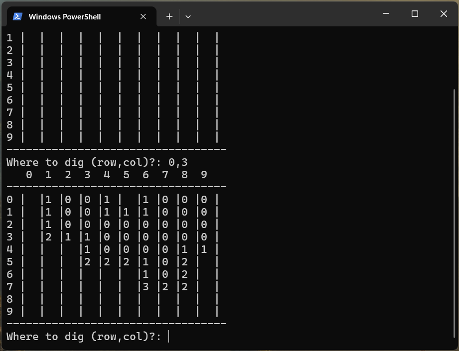
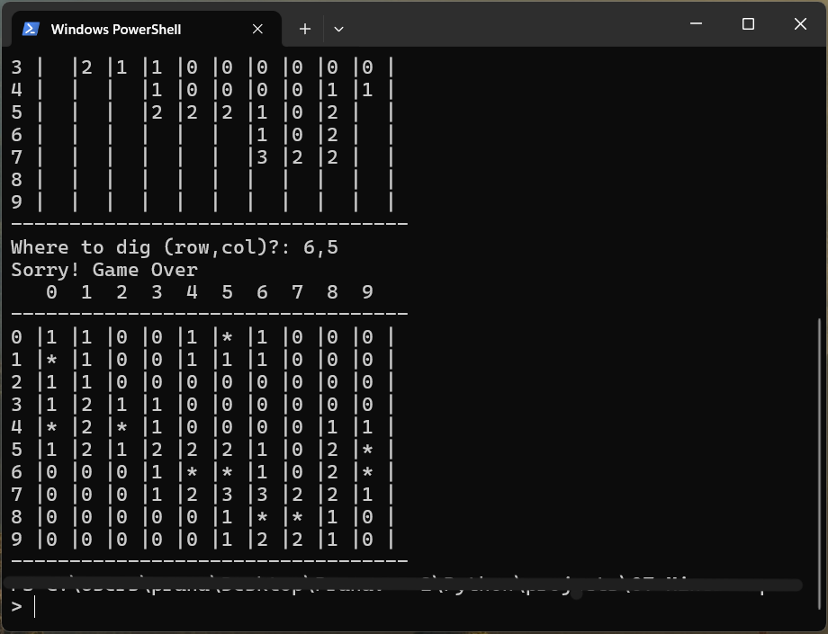

# 🧩 **Minesweeper Game** 💣

## Overview 🕹️

Welcome to the classic **Minesweeper** game, reimagined for the command-line! The goal is simple: **Uncover safe cells** without triggering any mines. But beware… one wrong move and BOOM 💥! Can you survive? Only time will tell! ⏳

---

## 🌟 Features 
✨ **Random Mine Placement**: Mines are placed randomly on the grid! Who knows where they might be? 🤔  
✨ **Customizable Board Size**: Set your own board size and mine count! 🎛️  
✨ **Recursive Digging**: If you uncover an empty cell, neighboring cells are automatically revealed. It's like magic! 🪄  
✨ **Game Over or Winning**: Either the mines get you or you win! 🎉  
✨ **Interactive CLI**: Your keyboard is your weapon! Type in coordinates and dig your way to victory! ⌨️  
✨ **Clean Board Display**: Track your progress with a neat board layout! 🧹

---

## 💥 **Example** 💥

Here’s an example of how the game board might look:

- `*` represents a **mine**. 💣  
- A number like `1`, `2`, or `3` means **that many mines** are adjacent to that cell. 😱  
- Empty spaces are just that: no mines nearby. 🌱

---

## 🔄 **Game Flow** 🔄

1. The game generates a random grid of mines and numbers. 🧩  
2. You start by selecting a cell, and the game will reveal what’s there! 🤫  
3. If it's safe, you either see a number or an empty space. If it's empty, surrounding cells are uncovered automatically. 🚀  
4. If you dig up a mine, it’s game over. 💥  
5. The game ends when **all safe cells are uncovered** or when a mine is triggered. Can you handle the pressure? 🧠

---

## 🎮 **How to Play** 🎮

1. **Get Started**: When the game begins, choose your board size and the number of mines. The default is a 10x10 grid with 10 mines. 🎲  
   
2. **Make a Move**: Enter coordinates to dig, formatted like `row,column` (e.g., `3,4`). Don’t make a mistake or you might trigger a mine! 🚫

3. **Uncovering Cells**:  
   - If you uncover a **number**, it shows how many mines are next to that cell. 🔢  
   - If you uncover an **empty space**, all neighboring cells will be revealed automatically! 🕵️‍♀️
   
4. **Game Over**: If you hit a mine 💣, the game ends, and you'll see the whole board revealed. Oops! 😱  
   
5. **Victory**: If you reveal all the safe cells without triggering any mines, you win! 🏅

---

## 👤 Author

Developed by Pranav Amrutkar.  
📫 Contact: pranavamrutkar09@gmail.com  
🌐 GitHub: [https://github.com/pranavamrutkar9](https://github.com/pranavamrutkar9)
